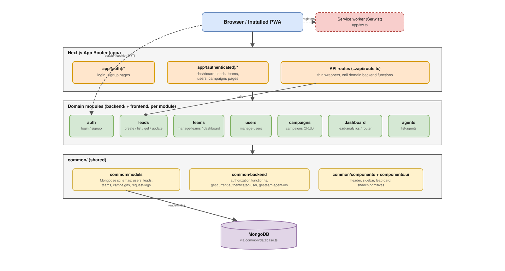

# BPO ERP — Lead Management Platform

> **Proprietary — All Rights Reserved.** This repository is public for hosting/deployment and GitHub organization reasons only; it is **not** open source. No permission is granted to use, copy, modify, or distribute this code. See [LICENSE](LICENSE).

A lead management web application built for **Mavrix Communications**, a business process outsourcing (BPO) center. Agents log leads as they work them; team leads track their team's pipeline; admins review leads, mark them billable/non-billable, manage users/teams/campaigns; and a dedicated QA role reviews lead quality.

This README is meant to get a new developer productive without having to read anything else first. For the deeper, more prescriptive rules this project's contributors (human or AI) follow day-to-day, see [AGENTS.md](AGENTS.md) and the [`agent-docs/`](agent-docs) folder — this file summarizes and links out to them.

## Tech stack

| Layer                     | Choice                                                                         |
| ------------------------- | ------------------------------------------------------------------------------ |
| Framework                 | [Next.js 16](https://nextjs.org) (App Router, Webpack build)                   |
| UI runtime                | React 19                                                                       |
| Language                  | TypeScript                                                                     |
| Database                  | MongoDB via [Mongoose 9](https://mongoosejs.com)                               |
| Styling / components      | Tailwind CSS + [shadcn/ui](https://ui.shadcn.com) (Radix primitives)           |
| Validation                | [Zod](https://zod.dev)                                                         |
| Auth                      | Custom session cookie + JWT (`jose`) and password hashing (`bcryptjs`)         |
| Offline / installable app | PWA via [Serwist](https://serwist.pages.dev) (service worker, manifest, icons) |
| Package manager           | **Yarn** (only — do not use npm/pnpm)                                          |
| Git hooks                 | Husky + commitlint + Prettier (lint-staged)                                    |

## Getting started

### Prerequisites

- Node.js (LTS) and Yarn
- A MongoDB instance (local or hosted, e.g. Atlas) and its connection string

### Setup

```bash
yarn install
cp .env.example .env   # then fill in the values, see below
yarn dev                # starts the dev server at http://localhost:3000
```

### Environment variables

See [.env.example](.env.example) for the full list. In short:

| Variable           | Required    | Purpose                                                                                                                                                                                                                                                                      |
| ------------------ | ----------- | ---------------------------------------------------------------------------------------------------------------------------------------------------------------------------------------------------------------------------------------------------------------------------- |
| `MONGODB_URI`      | Yes         | MongoDB connection string. The app throws at startup if this is missing ([common/database.ts](common/database.ts)).                                                                                                                                                          |
| `JWT_CREATION_KEY` | Recommended | Secret used to sign session JWTs ([auth/backend/login/create-session.function.ts](auth/backend/login/create-session.function.ts), [proxy.ts](proxy.ts)). Falls back to an insecure default in development if unset — **always set this in any shared/deployed environment.** |

### Other scripts

```bash
yarn build         # production build (must succeed before push is allowed, see Git workflow)
yarn start          # run the production build
yarn lint           # eslint
yarn seed:sample    # seed sample teams/campaigns/leads/users into the configured database
```

There is also `scripts/seed-qa-user.mjs` for seeding a Quality Assurance user — run it directly with `node scripts/seed-qa-user.mjs` once `MONGODB_URI` is set.

## Roles & permissions

Roles are defined in [common/constants/user-roles.enum.ts](common/constants/user-roles.enum.ts) and enforced both in navigation ([common/constants/navigation.ts](common/constants/navigation.ts)) and in backend authorization checks ([common/backend/authorization.function.ts](common/backend/authorization.function.ts)).

- **Agent** — creates leads and can see/track only their own leads. Lands on the personal dashboard.
- **Team Lead** — scoped to the team they lead (`team_id` on their user document). Sees a team dashboard with per-agent lead analytics and campaign breakdowns ([teams/backend/get-team-dashboard](teams/backend/get-team-dashboard)), can view/manage the agents on their team ([users/backend/manage-users](users/backend/manage-users)), and can activate/deactivate (not delete or promote) their own team's agent accounts. Cannot change roles or team assignment.
- **Quality Assurance (QA)** — a review-focused role. Can view the lead list (for QA purposes) but is redirected away from the dashboard straight to `/leads/list` ([dashboard/frontend/dashboard-router](dashboard/frontend/dashboard-router)); has no lead-creation or management access.
- **Admin** — full access: sees all leads across all teams, updates lead status (billable requires a reason when marking non-billable) and payment status, manages Teams (create teams, assign a team lead, assign agent members — [teams/backend/manage-teams](teams/backend/manage-teams)), manages Users (role, status, team assignment — [users/backend/manage-users](users/backend/manage-users)), and manages Campaigns (create/enable/disable — [campaigns/backend/campaigns](campaigns/backend/campaigns)).

User accounts also carry a `status`: `active`, `inactive`, or `blocked`.

## Core domain concepts

- **Lead** ([common/models/leads.schema.ts](common/models/leads.schema.ts)) — a prospective customer captured by an agent. Fields include `customer_name`, `customer_number`, `username`, `campaign`, `loan_type` (Conventional / FHA / VA / VA eligible), optional `loan_officer_name`, `loan_balance`, `home_value`, a `status` lifecycle (`pending` → `billable` / `non billable`, with a required `status_reason` when marked non-billable), and a `payment_status` (`paid` / `unpaid`, relevant once billable).
- **Team** ([common/models/teams.schema.ts](common/models/teams.schema.ts)) — a named group with one `team_lead` user; agents are assigned to a team via `team_id` on their user document.
- **Campaign** ([common/models/campaigns.schema.ts](common/models/campaigns.schema.ts)) — a named marketing/lead source, togglable active/inactive, attached to leads and used for filtering/reporting.
- **User** ([common/models/users.schema.ts](common/models/users.schema.ts)) — has a `role`, `status`, optional `team_id`, and tracks `created_by` (which admin/team-lead created the account).

## Project structure

Business logic is organized by **domain module**, not by framework layer. Each module has its own `backend/` and `frontend/` folders; the Next.js `app/` directory stays a thin routing layer that calls into these modules.

```
<module>/
  backend/<logic-name>/
    <logic-name>.function.ts       # the actual business logic (exported)
    <logic-name>.input-schema.ts   # Zod validation for inputs
    <logic-name>.type.ts           # response/shared types
    index.ts                       # barrel file — re-exports the function
  frontend/<view-name>/
    <view-name>.component.tsx      # the view
    <view-name>.hook.ts            # view logic / state
    <view-name>.api.ts             # calls the backend route
    components/<sub-component>/... # nested components, same pattern recursively
    index.ts                       # barrel file
```

Example: [leads/backend/create-lead](leads/backend/create-lead) and [leads/frontend/create-lead-form](leads/frontend/create-lead-form).

Other key locations:

- `app/` — Next.js App Router pages and API routes only (`app/(auth)/...` for login/signup, `app/(authenticated)/...` for the logged-in app). Each API route is a thin wrapper that calls a `<module>/backend/...` function.
- `common/` — shared Mongoose models (`common/models`), shared constants/enums (`common/constants`), shared backend helpers like auth/authorization (`common/backend`), and shared cross-module UI (`common/components`, e.g. header, sidebar, lead-card).
- `components/ui/` — raw shadcn/Radix primitives (button, input, select, calendar, etc.) — treat as generated, don't hand-roll alternatives.
- `agents/`, `auth/`, `campaigns/`, `dashboard/`, `leads/`, `teams/`, `users/` — the domain modules described above.
- `scripts/` — one-off/maintenance Node scripts (data seeding, branch checks) run outside the Next.js server.

## Architecture at a glance



The image above is generated from [docs/architecture.drawio](docs/architecture.drawio) — open that file at [app.diagrams.net](https://app.diagrams.net) or with the VS Code Draw.io Integration extension to edit the diagram, then re-export it as `docs/architecture.svg`.

## Coding conventions

(Full detail in [agent-docs/CODE_STYLE.md](agent-docs/CODE_STYLE.md).)

- **Naming**: variables in `camelCase`, maximally explanatory (no abbreviations for their own sake). Files are suffixed by role: `.function.ts`, `.hook.ts`, `.api.ts`, `.schema.ts`, `.input-schema.ts`, `.type.ts`, `.component.tsx`.
- **No `any`** — ever.
- Keep files under ~100 lines where reasonably possible; split logic into hooks/functions instead of growing one file.
- All API inputs are validated with a Zod schema in `<logic-name>.input-schema.ts` before the business logic runs.
- Database fields/variables are `snake_case` (Mongo/Mongoose convention) — this is the one place `snake_case` is correct; everything else in TS/TSX is `camelCase`.

## Database

- MongoDB via Mongoose. **All schemas live in `common/models/`** — new schemas belong there too, nowhere else.
- Database field names are `snake_case`.
- Schema changes (new or modified models) require explicit discussion and sign-off before implementation — see [agent-docs/DATABASE_DETAILS.md](agent-docs/DATABASE_DETAILS.md).

## Git workflow

- Husky hooks enforce, on every commit/push:
  1. Auto-format staged files (Prettier via lint-staged).
  2. **Block any push whose production build fails.**
  3. Lint commit messages via commitlint (conventional commits).
  4. **Block direct commits to the `production` branch** ([scripts/check-branch.sh](scripts/check-branch.sh)) — all changes go through a feature branch and a pull request.
- Typical flow: branch off `production` (or the current integration branch), commit, push, open a PR. See [agent-docs/SOURCE_CODE_MANAGEMENT.md](agent-docs/SOURCE_CODE_MANAGEMENT.md) for the full policy.

## Project history

The project started as a minimal Next.js + MongoDB skeleton with Husky/Prettier tooling, then grew in roughly this order:

1. **Auth & layout** — login/signup with bcrypt + JWT sessions, authenticated shell with responsive sidebar.
2. **Core lead management** — create/list/edit leads, admin billable/non-billable status updates with required reason, search/filter/date-range on the lead list.
3. **Lead metadata** — campaign association, agent listing, payment status (paid/unpaid), optional loan officer name, required lead username.
4. **PWA support** — manifest, icons, service worker (Serwist) for installable/offline use.
5. **Team & org management** — team-scoped dashboards, team lead role with scoped agent visibility, full team management (admin), user management (role/status/team assignment), campaign management, and a Quality Assurance role/workflow.

For what's actively being worked on next, see [agent-docs/FEATURES.md](agent-docs/FEATURES.md).

## Further reading

- [AGENTS.md](AGENTS.md) — entry point for the detailed, machine-oriented rules (also useful for humans who want the precise conventions).
- [agent-docs/CODE_STYLE.md](agent-docs/CODE_STYLE.md) — folder/file conventions in full.
- [agent-docs/ROLES.md](agent-docs/ROLES.md) — role permissions in full.
- [agent-docs/DATABASE_DETAILS.md](agent-docs/DATABASE_DETAILS.md) — database change policy.
- [agent-docs/TECHNICAL_DETAILS.md](agent-docs/TECHNICAL_DETAILS.md) — stack/tooling notes.
- [agent-docs/SOURCE_CODE_MANAGEMENT.md](agent-docs/SOURCE_CODE_MANAGEMENT.md) — git/PR policy in full.
- [agent-docs/FEATURES.md](agent-docs/FEATURES.md) — done work and current priorities.
- [docs/architecture.drawio](docs/architecture.drawio) — editable architecture diagram (draw.io / diagrams.net format).

## License

**All Rights Reserved.** This is proprietary, closed-source software — see [LICENSE](LICENSE) for the full terms. The repository is public only to satisfy hosting (Vercel free tier) and GitHub organization requirements; that does not grant anyone permission to use, copy, modify, or redistribute this code.
